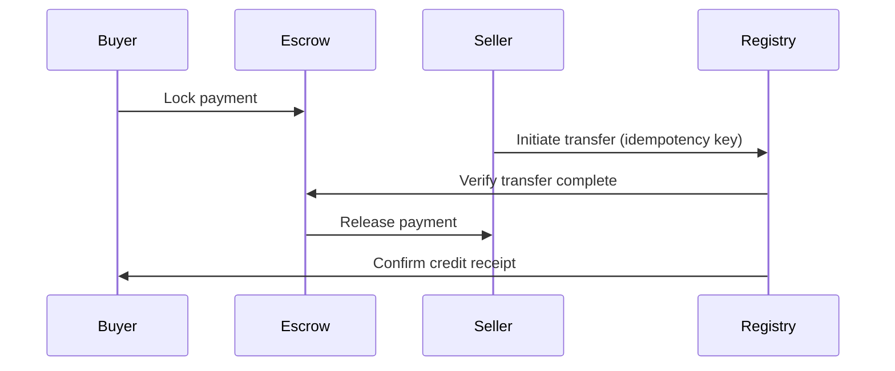

# C10: Registries & Credit Issuance
## Module 10.2: Account Types & Transactions (3 lessons × 40min = 2h)

### Lesson 10.2.1: Registry Architecture
**Lesson Code:** C10.1.1
**Duration:** 40 minutes
**Lesson Type:** document
**Tier:** professional

**Learning Objectives:**
1. Explain registry architecture: accounts, projects, credits, transactions (Bloom: Understand)
2. Differentiate account types: project, holding, retirement, cancellation (Bloom: Analyze)
3. Navigate registry APIs: query, transfer, retire, cancel (Bloom: Apply)

**Prerequisites:** C03.2.3, C08.3.1

**Why This Matters:**
Registries are the infrastructure of carbon markets. Every credit lives in a registry account; every transfer, retirement, or cancellation is a registry transaction. Understanding registry architecture lets you design systems that interact with registries correctly and avoid costly errors.

**Core Concept: Registry = Immutable Ledger of Credit Ownership & Status**

### 10.2.1.1 Registry Architecture — Core Components

| Component | Function | Key Entities |
|-----------|----------|--------------|
| **Accounts** | Hold credits; have types & permissions | Project, Holding, Retirement, Cancellation |
| **Projects** | Metadata + crediting period + methodology | Project ID, status, vintage range |
| **Credits** | Individual units with serial numbers | Serial, vintage, project, status |
| **Transactions** | Transfer, retire, cancel, issuance | From, to, quantity, serial range, timestamp |
| **Users/Roles** | Access control | Admin, Trader, Viewer, Verifier |

### 10.2.1.2 Account Types & Hierarchy

| Account Type | Purpose | Can Hold Credits | Can Transfer | Can Retire | Typical Holder |
|--------------|---------|------------------|--------------|------------|----------------|
| **Project Account** | Receives issuance | Yes | Yes (to holding) | No | Project Developer |
| **Holding Account** | General custody & trading | Yes | Yes | Yes | Corporate, Broker |
| **Retirement Account** | Permanent removal for claims | Yes | No | Yes (only action) | Corporate Buyer |
| **Cancellation Account** | Compliance surrender | Yes | No | N/A | Compliance Entity |
| **Buffer/Buffer Pool** | AFOLU reversal insurance | Yes (system) | No (auto) | N/A | Registry |

### 10.2.1.3 Credit Lifecycle — Registry States

```
ISSUANCE → ACTIVE (Project Account)
    ↓ TRANSFER
ACTIVE (Holding Account)
    ↓ RETIREMENT
RETIRED (Immutable)
    ↓ CANCELLATION (Compliance)
CANCELLED (Immutable)
```

**Credit State Machine:**
| State | Transitions | Use Case |
|-------|-------------|----------|
| **Pending** | → Active (issuance) | Newly issued, not yet activated |
| **Active** | → Active (transfer), → Retired, → Cancelled | Trading, holding |
| **Retired** | Terminal | Voluntary claim |
| **Cancelled** | Terminal | Compliance (CORSIA, Art 6, ETS) |

### 10.2.1.4 Serial Number Structure

| Registry | Format | Example |
|----------|--------|---------|
| **Verra (VCU)** | `VCU-XXXX-YYYY-NNNNNNN` | VCU-1234-2024-0000001 |
| **Gold Standard** | `GS-XXX-YYYY-NNNNNNN` | GS-123-2024-0000001 |
| **CDM** | `CER-XXXX-YYYY-NNNNNNN` | CER-1234-2024-0000001 |
| **ART/TREES** | `TREES-XXXX-YYYY-NNNNNNN` | TREES-123-2024-0000001 |
| **CCTS (India)** | `CCC-YYYY-NNNNNNNN` | CCC-2024-00000001 |

### 8.2.1.5 Professional Judgement Points
- **Serial integrity:** Never assume sequential; gaps = retired/cancelled
- **Vintage integrity:** Never mix vintages in single transfer/retirement
- **Account segregation:** Project ≠ Holding ≠ Retirement — enforce at API level
- **Audit trail:** Every transaction must be traceable to source (issuance/transfer)

### 8.2.1.6 Practical Exercise: Registry Navigation
*Scenario:* You have 50,000 VCUs in Project Account. Need to: (a) transfer 30k to Holding, (b) retire 15k for VCMI Platinum claim, (c) sell 5k OTC.
*Tasks:*
1. Design transaction sequence (API calls)
2. Identify vintage allocation strategy
3. Design error handling (insufficient balance, vintage mismatch)
*Time:* 30 min
*Deliverable:* Transaction sequence diagram + error handling logic
*Rubric:* Sequence correctness (40%), vintage logic (30%), error handling (30%)

**Knowledge Check:**
1. Can credits move directly from Project Account to Retired? (No — must go through Holding)
2. What is the difference between Retired and Cancelled? (Voluntary vs Compliance)
3. Can a credit be "un-retired"? (No — immutable)
4. What is a buffer pool account? (AFOLU reversal insurance; system-managed)

**Sources:**
1. Verra Registry System Specification (2024)
3. Gold Standard Registry Requirements (2023)
4. CDM Registry & Transaction Log (2023)
5. Article 6.4 Registry Technical Spec (2023)
5. CCTS Registry Spec (BEE 2023)

---
*Lesson Version: 1.0 | Author: [Author] | Reviewer: [Reviewer] | Last Verified: 2026-01-25 | Content Risk: DYNAMIC (Registry APIs evolving) | Regulatory Review: Quarterly*

---

### Lesson 10.2.2: Account Types & Transactions
**Lesson Code:** C10.2.2
**Duration:** 40 minutes
**Lesson Type:** document
**Tier:** professional

**Learning Objectives:**
1. Execute registry transactions: transfer, retire, cancel, issuance request (Bloom: Apply)
2. Design transaction workflows with error handling and idempotency (Bloom: Create)
3. Implement settlement: DvP, escrow, atomic swap (Bloom: Apply)

**Prerequisites:** C10.1.1

**Why This Matters:**
Registry transactions are where credits change hands, get retired for claims, or cancelled for compliance. A failed transaction can mean lost credits, double counting, or compliance failure. This lesson teaches you to build bulletproof transaction workflows.

**Core Concept: Registry Transaction = Atomic State Change with Audit Trail**

### 10.2.2.1 Transaction Types & Mechanics

| Transaction | From | To | Trigger | Settlement |
|-------------|------|-----|---------|------------|
| **Issuance** | Registry → Project Account | Verification opinion | Registry |
| **Transfer** | Holding A → Holding B | Trade, OTC, exchange | T+0 to T+2 |
| **Retirement** | Holding → Retired | Voluntary claim | Immediate |
| **Cancellation** | Holding → Cancelled | Compliance (CORSIA, Art 6, ETS) | Immediate |
| **Transfer to Retirement** | Holding → Retired (single step) | Claim + transfer | Atomic |
| **Buffer Draw** | Buffer Pool → Retired | Reversal event | Registry auto |

### 10.2.2.2 Transaction API Patterns

**RESTful Patterns (Typical):**
```http
POST /api/v1/credits/transfer
{
  "from_account": "HOLD-12345",
  "to_account": "HOLD-67890",
  "serial_range": "VCU-1234-2024-0000001 to VCU-1234-2024-0010000",
  "vintage": "2024",
  "reason": "OTC Sale",
  "idempotency_key": "txn-20240315-001"
}

POST /api/v1/credits/retire
{
  "account": "HOLD-12345",
  "serial_range": "VCU-1234-2024-0000001 to VCU-1234-2024-0005000",
  "reason": "VCMI Platinum Claim FY2024",
  "beneficiary": "Acme Corp",
  "claim_type": "VCMI Platinum"
}

POST /api/v1/credits/cancel
{
  "account": "HOLD-12345",
  "serial_range": "CCC-2024-0000001 to CCC-2024-0005000",
  "compliance_mechanism": "CORSIA",
  "vintage": "2022"
}
```

### 10.2.2.3 Idempotency & Error Handling

**Idempotency Keys — Mandatory for All Mutations:**
```json
{
  "idempotency_key": "txn-20240315-abc123",
  "operation": "transfer",
  "payload": { ... }
}
```
- Client generates unique key per business transaction
- Registry stores key + result; duplicate key = return cached result
- Prevents double-spend on retry/network timeout

**Error Handling Patterns:**
| Error | HTTP Code | Retry Strategy |
|-------|-----------|----------------|
| **Insufficient Balance** | 400 | Don't retry; fix balance |
| **Vintage Mismatch** | 400 | Don't retry; fix serial range |
| **Account Frozen** | 403 | Investigate; don't retry |
| **Registry Timeout** | 504 | Retry with same idempotency key |
| **Rate Limit** | 429 | Exponential backoff |
| **Vintage Exhausted** | 409 | Adjust serial range; retry |

### 10.2.2.4 Settlement — DvP, Escrow, Atomic Swap

**Delivery vs Payment (DvP) — Atomic Transfer + Payment:**


**Settlement Models:**
| Model | Use Case | Settlement Time | Counterparty Risk |
|-------|----------|-----------------|-------------------|
| **Registry DvP** | Exchange, trusted counterparty | T+0 to T+1 | Low (registry guarantees) |
| **Escrow Agent** | OTC, unknown counterparty | T+1 to T+3 | Low (escrow holds) |
| **Bilateral DvP** | Trusted counterparties | T+0 | Medium (contractual) |
| **Atomic Swap (Blockchain)** | DeFi, tokenized credits | Near-instant | Low (smart contract) |

### 10.2.2.4 Professional Judgement Points
- **Always use idempotency keys** — network retries without them = double spend
- **Vintage allocation strategy:** FIFO vs LIFO vs specific vintage — document policy
- **Settlement finality:** Know when transfer is irreversible (registry confirmation vs bank settlement)
- **Audit trail:** Every transaction must link to source (trade ID, contract, retirement claim)

### 10.2.2.4 Practical Exercise: Transaction Workflow Design
*Scenario:* Build a credit trading desk system. Requirements: OTC trades, exchange integration, retirement for VCMI claims, CORSIA cancellation.
*Tasks:*
1. Design transaction state machine (states, transitions, validations)
2. Design idempotency key generation & storage
3. Design error handling for: insufficient balance, vintage mismatch, registry timeout
4. Design settlement integration (escrow API, DvP)
*Time:* 45 min
*Deliverable:* State machine diagram + API spec + error handling matrix
*Rubric:* State machine correctness (40%), idempotency design (30%), error handling (30%)

**Knowledge Check:**
1. What is an idempotency key and why is it required? (Unique key per business transaction; prevents double-execution on retry)
2. What is DvP? (Delivery vs Payment — atomic transfer + payment)
3. Can a credit be transferred after retirement? (No — retired is terminal state)
4. What is the difference between retirement and cancellation? (Voluntary claim vs compliance surrender)

**Sources:**
1. Verra Registry API Specification (2024)
3. Gold Standard Registry API (2023)
4. CDM Registry Transaction Log (2023)
5. Article 6.4 Registry Technical Spec (2023)
5. CCTS Registry Spec (BEE 2023)
5. Verra Registry API (2024)

---
*Lesson Version: 1.0 | Author: [Author] | Reviewer: [Reviewer] | Last Verified: 2026-01-25 | Content Risk: DYNAMIC (Registry APIs evolving) | Regulatory Review: Quarterly*

---

### Lesson 10.2.3: Issuance & Retirement Mechanics
**Lesson Code:** C10.2.3
**Duration:** 40 minutes
**Lesson Type:** document
**Tier:** professional

**Learning Objectives:**
1. Execute the issuance workflow: verification → request → registry checks → issuance (Bloom: Apply)
2. Execute retirement/cancellation workflows with claim mapping (Bloom: Apply)
3. Handle edge cases: vintage splits, buffer draws, reversals, cancellations (Bloom: Analyze)

**Prerequisites:** C10.2.1, C03.2.3, C03.2.2

**Why This Matters:**
Issuance is where monitoring data becomes tradeable assets. Retirement is where credits fulfill their purpose. Both are high-stakes operations — errors mean financial loss, compliance failure, or reputational damage. This lesson teaches you to execute these workflows flawlessly.

**Core Concept: Issuance = Verification → Registry Checks → Serial Assignment; Retirement = Purpose + Proof**

### 10.2.3.1 Issuance Workflow — End-to-End

**Issuance Workflow:**
```
Verification Opinion (Positive)
       ↓
Project Requests Issuance (Registry)
       ↓
Registry Checks:
  ✓ Verification opinion valid & positive
  ✓ Project registered & active
  ✓ Crediting period valid
  ✓ No overlapping issuance
  ✓ Buffer/contribution met (if applicable)
       ↓
Registry Issues Credits (Serial Numbers Assigned)
       ↓
Credits Deposited in Project Account (Pending/Active)
       ↓
Project Account Holder Manages Credits
```

**Registry Checks at Issuance:**
| Check | Failure Consequence |
|-------|---------------------|
| Verification opinion valid & positive | Issuance blocked |
| Project registered & active | Issuance blocked |
| Crediting period valid (vintage within) | Issuance blocked / vintage split |
| No overlapping issuance (same vintage) | Duplicate issuance rejected |
| Buffer/contribution met (AFOLU) | Issuance quantity reduced |

### 10.2.3.2 Issuance Request & Serial Assignment

**Issuance Request Payload:**
```json
{
  "project_id": "PROJ-12345",
  "vintage": "2024",
  "quantity": 150000,
  "verification_report_id": "VR-2024-001234",
  "monitoring_period": "2024-01-01 to 2024-12-31",
  "requested_serial_start": "VCU-1234-2024-0000001"  // optional
}
```

**Registry Response:**
```json
{
  "issuance_id": "ISS-2024-004567",
  "serial_range": "VCU-1234-2024-0000001 to VCU-1234-2024-0150000",
  "quantity": 150000,
  "vintage": "2024",
  "status": "active",
  "deposited_in": "PROJ-ACC-12345",
  "issued_at": "2024-03-15T10:30:00Z"
}
```

### 10.2.3.3 Retirement Workflow — Claim-Driven

**Retirement Request:**
```json
{
  "serial_range": "VCU-1234-2024-0000001 to VCU-1234-2024-0010000",
  "retirement_reason": "Voluntary carbon neutrality claim FY2024",
  "retirement_details": {
    "claim_type": "VCMI Platinum",
    "entity_name": "Acme Corp",
    "reporting_period": "FY2024",
    "beneficiary": "Acme Corp"
  },
  "retired_by": "account_holder_id",
  "authorized_by": "authorized_signatory"
}
```

**Critical Retirement Fields:**
| Field | Requirement | Common Error |
|---------|-------------|--------------|
| **Serial Range** | Exact, contiguous, valid | Gaps, overlaps, invalid serials |
| **Vintage** | Must match claim period | Using wrong vintage |
| **Standard** | Must match claim eligibility | Non-eligible standard |
| **Retirement Reason** | Specific claim type | Generic "voluntary" |
| **Beneficiary** | Legal entity name | Mismatched entity |
| **Retirement Date** | Timestamp of action | Backdating |

**Retirement Proof Package (Audit-Ready):**
1. **Retirement Confirmation** (Registry PDF with serials, timestamp, hash)
2. **Retirement Reason Statement** (Claim type, period, entity)
3. **Credit Provenance** (Project ID, vintage, standard, verification report)
3. **Chain of Custody** (Issuance → transfers → retirement)
4. **Claim Mapping** (How credits map to reported emissions)

### 10.2.3.2 Cancellation Workflow — Compliance Surrender

**Cancellation vs Retirement:**
| Aspect | Retirement | Cancellation |
|--------|------------|--------------|
| **Purpose** | Voluntary claim | Compliance obligation |
| **Mechanism** | Registry "retire" | Registry "cancel" |
| **Use Case** | VCMI, carbon neutral, net-zero | CORSIA, Art 6, ETS surrender |
| **Reversibility** | No | No |
| **Proof** | Retirement certificate | Cancellation certificate |

**Cancellation Request (CORSIA Example):**
```json
{
  "serial_range": "VCU-1234-2022-0000001 to VCU-1234-2022-0010000",
  "cancellation_reason": "CORSIA compliance 2024",
  "compliance_mechanism": "CORSIA",
  "airline": "Air India",
  "vintage": "2022"
}
```

### 10.2.3.2 Edge Cases & Error Handling

| Edge Case | Detection | Resolution |
|-----------|-----------|------------|
| **Vintage Split** | Request spans vintages | Split request per vintage |
| **Partial Serial Range** | Request < full serial block | Registry supports partial |
| **Buffer Draw** | AFOLU reversal | Registry auto-draws from buffer |
| **Over-Issuance Request** | Request > verified ERs | Reject; request ≤ verified |
| **Vintage Mismatch** | Monitoring period spans vintage boundary | Split monitoring report by vintage |
| **Double Issuance** | Same vintage requested twice | Registry rejects duplicate |

### 10.2.3.3 Cross-Checks & Verification Package

**Issuance Cross-Checks:**
| Check | Expected | Tolerance | Action if Fail |
|--------|----------|-----------|----------------|
| **Fuel Mass Balance** | Receipts + Open - Close = Consumption | ±2% | Investigate |
| **Energy Balance** | Fuel Energy = Elec Out + Heat Rate × Gen | ±3% | Check heat rate |
| **CEMS vs Calculated** | CEMS CO2 vs Fuel Calc | ±5% | Investigate bias |
| **Scope 2 Cat 3 vs Scope 1** | Cat 3 = f(Scope 1 fuel) | ±5% | Check upstream EF |
| **Scope 3 Cat 11 vs Product Data** | Units sold × lifetime = Cat 11 | ±10% | Check usage profiles |

### 10.2.3.3 Professional Judgement Points
- **Vintage integrity:** Never mix vintages in single issuance/retirement request
- **Serial contiguity:** Registry assigns contiguous blocks; gaps = retired/cancelled
- **Buffer monitoring:** AFOLU projects — monitor buffer balance quarterly
- **Reversal preparedness:** Pre-negotiate buffer insurance; have reversal response plan
- **Audit trail:** Every credit must have complete chain-of-custody from issuance to current holder

### 10.2.3.3 Practical Exercise: Issuance & Retirement Workshop
*Scenario:* 100 MW wind project. Verification complete: 150,000 tCO2e verified (vintage 2024). Client wants: (a) issue all, (b) retire 50k for VCMI Gold, (c) sell 80k OTC, (d) hold 20k.
*Tasks:*
1. Draft issuance request with vintage handling
2. Design retirement request for VCMI Gold (vintage, quantity, claim mapping)
3. Design OTC transfer for 80k (SPA → registry transfer → payment)
4. Identify cross-checks for verification package
*Time:* 50 min
*Deliverable:* Issuance/retirement request payloads + transfer workflow
*Rubric:* Payload correctness (40%), vintage handling (30%), workflow completeness (30%)

**Knowledge Check:**
1. What registry checks happen at issuance? (Valid verification, active project, valid vintage, no overlap, buffer met)
2. What is the difference between "retired" and "cancelled" status? (Voluntary claim vs compliance surrender)
3. Can you issue credits for a vintage outside the crediting period? (No — issuance blocked)
4. What happens if issuance request exceeds verified ERs? (Rejected; must request ≤ verified)

**Sources:**
1. Verra Registry System Specification (2024)
3. Gold Standard Registry Requirements (2023)
4. CDM Registry & Transaction Log (2023)
5. Article 6.4 Registry Technical Spec (2023)
5. CCTS Registry Spec (BEE 2023)

---
*Lesson Version: 1.0 | Author: [Author] | Reviewer: [Reviewer] | Last Verified: 2026-01-25 | Content Risk: DYNAMIC (Registry APIs evolving) | Regulatory Review: Quarterly*