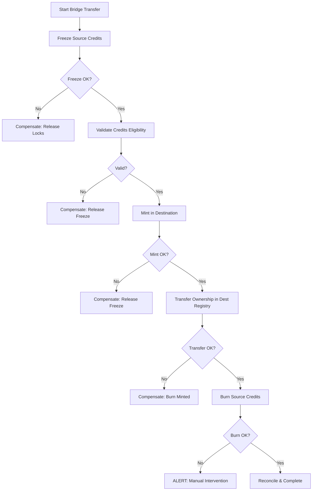

# C15: EtherTrack Platform & Workflows
## Module 15.2: Project Onboarding & Bridge Config (3 lessons × 40min = 2h)

### Lesson 15.2.1: Project Onboarding — From Concept to Issuance
**Lesson Code:** C15.2.1
**Duration:** 40 minutes
**Lesson Type:** document
**Tier:** india_ether_track

**Learning Objectives:**
1. Execute the end-to-end project onboarding workflow: concept → PDD → validation → registration → issuance (Bloom: Apply)
2. Automate methodology selection, applicability checks, and document validation (Bloom: Apply)
3. Build a developer portal that guides project proponents from concept to first issuance (Bloom: Create)

**Prerequisites:** C15.1.1, C06.1.1, C06.2.1, C08.1.1

**Why This Matters:**
Project onboarding is the "front door" of the carbon market. A smooth, guided experience converts project ideas into registered credits; a clunky process loses developers to competing platforms. This lesson teaches you to build an onboarding experience that converts.

**Core Concept: Onboarding = Product — Not Process**

### 15.2.1.1 End-to-End Onboarding Workflow

**Project Onboarding Funnel:**
```
CONCEPT → PRE-SCREEN → PDD DRAFT → VALIDATION → REGISTRATION → MONITORING → ISSUANCE
   │              │            │           │            │              │
   ▼              ▼            ▼           ▼            ▼              ▼
  Intake Form   Eligibility   PDD Wizard   VVB Match   Registry Sub   Monitoring
  (5 min)       Check (Auto)   (Guided)    (Auto-Match)  (API)        Setup
```

**Stage Gates & Exit Criteria:**
| Stage | Entry Criteria | Exit Criteria | Owner | SLA |
|-------|----------------|---------------|-------|-----|
| **Intake** | Project concept submitted | Eligibility pass/fail | Platform | < 1 hr |
| **Pre-Screen** | Concept submitted | Eligibility: PASS/FAIL + reasons | Auto-engine | < 5 min |
| **PDD Draft** | Eligibility PASS | PDD v1.0 complete; all sections filled | Proponent | 2-4 weeks |
| **Validation** | PDD submitted | Automated checks PASS; VVB matched | Platform + VVB | 5-10 business days |
| **Registration** | Validation PASS | Registry accepts; Project ID assigned | Standard Body | 5-10 days |
| **Monitoring Setup** | Registered | Sensors connected; MR template assigned | Proponent | 1-2 weeks |
| **First Issuance** | Monitoring period complete | Verification PASS; Credits in account | VVB + Registry | 30-60 days |

### 15.2.1.1 Intake & Eligibility — Automated Gatekeeping

**Intake Form (Minimal Viable Input):**
```json
{
  "project_name": "Rajasthan Solar 100MW",
  "project_type": "renewable_energy",
  "technology": "solar_pv",
  "capacity_mw": 100,
  "location": {"country": "India", "state": "Rajasthan", "district": "Jodhpur", "coordinates": [26.3, 73.0]},
  "methodology_preference": "VCS_AMS_I_D",
  "estimated_annual_ers": 180000,
  "expected_vintage_start": "2024",
  "developer": {"name": "SolarCo India", "contact": "ops@solarco.in", "entity_type": "private"},
  "land_status": "owned",
  "grid_connection": "approved",
  "ppa_status": "signed",
  "estimated_cod": "2024-06-01"
}
```

**Automated Eligibility Engine:**
```python
def check_eligibility(project_data):
    rules = [
        # Methodology applicability
        Rule("methodology_supports_tech", 
             project_data.technology in methodology.supported_technologies),
        Rule("capacity_in_range", 
             methodology.min_capacity <= project_data.capacity_mw <= methodology.max_capacity),
        Rule("geography_allowed", 
             project_data.country in methodology.approved_countries),
        Rule("vintage_alignment", 
             project_data.estimated_cod.year >= methodology.min_vintage_year),
        # Regulatory
        Rule("land_rights_secured", project_data.land_status in ["owned", "leased_long_term"]),
        Rule("grid_connection", project_data.grid_connection in ["approved", "existing"]),
        Rule("ppa_or_offtake", project_data.ppa_status in ["signed", "negotiating"]),
        # Additionality screen
        Rule("not_regulatory_surplus", not is_mandated_by_law(project_data)),
        Rule("not_registered_elsewhere", not registry_check(project_data))
    ]
    return EvaluationResult(passed=all(r.passed for r in rules), details=...)
```

**Eligibility Output:**
```json
{
  "eligible": true,
  "methodology": "VCS_AMS_I_D_v18",
  "score": 92,
  "flags": [],
  "recommended_vvb": ["SGS", "DNV", "TUV"],
  "estimated_ers_per_year": 180000,
  "estimated_timeline": "12-16 weeks to first issuance",
  "estimated_cost": {"validation": 25000, "verification": 15000, "issuance": 5000, "registry": 2000}
}
```

### 15.2.1.2 PDD Authoring — Guided, Validated, Versioned

**PDD Authoring Wizard (Step-by-Step):**
```
STEP 1: Project Identity → STEP 2: Boundary → STEP 3: Baseline → STEP 4: Additionality
    │                        │                  │                  │
    ▼                        ▼                  ▼                  ▼
Project Meta           GIS Upload +        Baseline Scenario    Additionality Wizard
  Name, Type,          Boundary Drawing    Selection +         Investment/Barrier/
  Location,            (GeoJSON/KML)       Justification       Common Practice
  Developer                                                    Test
        │                        │                  │                  │
        ▼                        ▼                  ▼                  ▼
STEP 5: Monitoring Plan → STEP 6: Stakeholder → STEP 7: Review → SUBMIT
    │                        │                  │              │
    ▼                        ▼                  ▼              ▼
Parameter             Stakeholder          Completeness      Submission
Selection, Frequency,  Map, FPIC,           Checklist,       Package
QA/QC, Responsible    Grievance Mech       Auto-Validation   Generation
```

**Real-Time Validation (During Authoring):**
| Check | Trigger | Severity | Resolution |
|-------|---------|----------|------------|
| **Methodology Applicability** | On section save | Error | Link to methodology clause |
| **Parameter Completeness** | On field blur | Warning | Highlight missing field |
| **Calculation Consistency** | On formula change | Error | Highlight cell + suggestion |
| **Document Completeness** | On section complete | Info | Checklist progress |
| **Cross-Reference** | On submit | Error | Link to referenced section |

**Version Control & Collaboration:**
- Git-like history for PDD (every save = commit)
- Branching: `draft` → `review` → `submit`
- Comments/annotations on sections (Google Docs style)
- Approval workflow: Proponent → Technical Review → Legal → Submit

### 15.2.1.3 Validation & VVB Matching — Automated

**Validation Pipeline (Automated Pre-Check):**
```python
def validate_pdd(pdd):
    checks = [
        # Completeness
        Check("all_sections_complete", lambda pdd: all(s.complete for pdd.sections)),
        Check("methodology_applicability", lambda pdd: check_applicability(pdd)),
        Check("boundary_consistency", lambda pdd: check_gis_topology(pdd.boundary)),
        Check("baseline_methodology", lambda pdd: pdd.baseline.method in methodology.allowed_baselines),
        Check("additionality_argument", lambda pdd: pdd.additionality.has_evidence()),
        Check("monitoring_plan_complete", lambda pdd: all(p.frequency for p in pdd.monitoring.parameters)),
        Check("stakeholder_consultation", lambda pdd: pdd.stakeholder.meetings >= methodology.min_meetings),
        Check("safeguards_complete", lambda pdd: pdd.safeguards.fpic and pdd.safeguards.grievance),
        Check("monitoring_parameters", lambda pdd: all(p.source for p in pdd.monitoring.parameters)),
    ]
    return ValidationResult(checks)
```

**VVB Matching Algorithm:**
```python
def match_vvb(project, vvb_pool):
    scored = []
    for vvb in vvb_pool:
        score = 0
        score += 10 if vvb.accredited_for(project.methodology) else -100
        score += 10 if vvb.sector_experience == project.sector else 0
        score += 5 if vvb.region_experience == project.region else 0
        score += 5 if vvb.capacity >= project.estimated_ers else 0
        score += 5 if vvb.language_support == project.region_language else 0
        score += 5 if vvb.availability < 30_days else 0
        scored.append((vvb, score))
    return sorted(scored, key=lambda x: x[1], reverse=True)
```

### 15.2.1.3 Registration & Issuance — Automated Handoff

**Registration → Issuance Flow:**
```
VALIDATION PASS
    ↓
STANDARD BODY REVIEW (5-10 days)
    ├── Completeness check
    ├── Methodology compliance
    ├── Additionality sign-off
    └── VVB validation
    ↓
REGISTRATION
    ├── Project ID assigned
    ├── Crediting period set
    ├── Monitoring period schedule
    └── Project page live on registry
    ↓
MONITORING PERIOD
    ├── Proponent submits MR (quarterly/annual)
    ├── VVB verification (scheduled)
    └── Verification report → Standard body
    ↓
ISSUANCE REQUEST
    ├── ER calculation verified
    ├── Serial numbers assigned
    ├── Credits deposited in Project Account
    └── Notification to proponent
```

**Issuance Request Payload:**
```json
{
  "project_id": "PROJ-12345",
  "monitoring_period": "2024-01-01/2024-12-31",
  "verification_report_id": "VR-2025-001234",
  "requested_er_quantity": 180000,
  "vintage": 2024,
  "serial_range_requested": "VCU-1234-2024-000001-180000",
  "requested_by": "dev@solarco.in",
  "supporting_docs": ["verification_report.pdf", "monitoring_report.pdf", "calculation_workbook.xlsx"]
}
```

**Issuance SLA:**
| Step | SLA | Escalation |
|--------|------|------------|
| Standard Body Review | 5-10 business days | Auto-escalate at 80% SLA |
| Registry Issuance | 1-2 business days | Auto-escalate at 48h |
| Credit Deposit | Real-time (webhook) | Alert at 1h delay |

### 15.2.1.3 Developer Portal — Self-Service Onboarding

**Portal Features:**
| Feature | Description |
|---------|-------------|
| **Project Dashboard** | Status tracker, document vault, task list, timeline |
| **PDD Builder** | Guided wizard, real-time validation, version history |
| **Document Vault** | Versioned storage, access control, audit trail |
| **VVB Marketplace** | Browse, compare, request quotes, schedule |
| **Compliance Tracker** | Monitoring schedule, submission status, deadlines |
| **Issuance Tracker** | Credit balance, vintage split, serial ranges |
| **API Access** | SDKs (Python, JS, Go), API keys, webhook management |

**API for Proponents:**
```python
# Create project
POST /api/v1/projects
{"name": "Rajasthan Solar 100MW", "type": "renewable_energy", ...}

# Upload PDD section
PUT /api/v1/projects/{id}/sections/{section_id}
{"content": {...}, "version": "2.1"}

# Submit for validation
POST /api/v1/projects/{id}/submit
{"target_standard": "VCS", "methodology": "AMS-I.D_v18"}

# Check status
GET /api/v1/projects/{id}/status
# Returns: {"stage": "VALIDATION", "progress": 65%, "next_action": "VVB matching"}

# Webhook for status changes
POST /webhooks/project_status
{"project_id": "PROJ-123", "status": "REGISTERED", "timestamp": "..."}
```

### 15.2.1.3 Professional Judgement Points
- **Automation first, human review for exceptions:** 80% auto-validated; 20% expert review
- **Fail fast, fail early:** Kill ineligible projects at intake, not at validation
- **VVB as a service:** Match, schedule, contract — all in platform
- **Developer experience = conversion rate:** Frictionless onboarding = more projects
- **Audit trail from day one:** Every click, decision, upload logged for audit

### 15.2.1.4 Practical Exercise: Onboarding Flow Design
*Scenario:* Design the onboarding flow for a new project type: **"Blue Carbon Mangrove Restoration"** (VM0033 methodology) in Gujarat. No existing template exists.
*Tasks:*
1. Design intake form (fields, validation rules)
2. Define PDD template sections specific to mangroves
3. Map methodology applicability rules (VM0033 specific)
4. Define VVB matching criteria (mangrove expertise, regional)
4. Design monitoring plan template (tidal, salinity, biomass)
*Time:* 45 min
*Deliverable:* Onboarding spec (intake form, PDD sections, validation rules, VVB criteria)
*Time:* 40 min
*Rubric:* Completeness (40%), methodology alignment (30%), UX consideration (30%)

**Knowledge Check:**
1. What is the single biggest reason projects fail at validation? (Incomplete additionality argument)
2. Why separate "intake" from "PDD drafting"? (Fail fast; save developer time)
3. How do you handle a methodology that doesn't exist yet? (Methodology deviation process; or new methodology submission)
4. What is the ideal VVB match score threshold for auto-approval? (≥80/100)

**Sources:**
1. Verra — Project Registration Process
2. Gold Standard — Project Design Document requirements
3. CDM Project Standard v3.0 — PDD guidelines
4. CDM Methodological Tools (Tool 01, 02, 07, 16, 19, 21, 27)
5. ICVCM Core Carbon Principles (2023) — Principles 4, 5, 6, 7
6. BEE CCTS Guidelines (2023) — Project Registration Guide

---
*Lesson Version: 1.0 | Author: [Author] | Reviewer: [Reviewer] | Last Verified: 2026-01-25 | Content Risk: DYNAMIC (Onboarding UX evolving) | Regulatory Review: Quarterly*

---

### Lesson 15.2.2: Bridge Configuration — International Credits, CCTS & Article 6
**Lesson Code:** C15.2.2
**Duration:** 40 minutes
**Lesson Type:** document
**Tier:** india_ether_track

**Learning Objectives:**
1. Configure bridge adapters for major registries: Verra, Gold Standard, CDM, ART, CCTS (Bloom: Apply)
2. Implement bridging logic: freeze → mint → transfer → burn (Bloom: Apply)
3. Design bridge monitoring: health, latency, reconciliation, disaster recovery (Bloom: Create)

**Prerequisites:** C15.1.1, C13.1.3, C13.2.3, C14.3.1

**Why This Matters:**
Bridges are the highways connecting isolated carbon registries. A broken bridge means frozen credits, failed trades, and regulatory risk. A well-designed bridge is invisible — credits flow seamlessly across registries, standards, and jurisdictions. This lesson teaches you to build bridges that are robust, auditable, and regulator-ready.

**Core Concept: Bridge = Trusted Translation Layer — Freeze → Mint → Transfer → Burn**

### 15.2.2.1 Bridge Architecture — Core Patterns

**Bridge Topology:**
```
SOURCE REGISTRY          ETHERTRACK BRIDGE          DESTINATION REGISTRY
┌─────────────────┐      ┌──────────────────┐      ┌─────────────────────┐
│  Verra / GS /    │─────▶│  BRIDGE SERVICE  │─────▶│  ICMS (CCTS)       │
│  CDM / ACR /     │      │  • Freeze        │      │  (CCTS)            │
│  ART / ACR       │      │  • Validate      │      │  • CCC Issuance    │
│  CCTS (Export)   │      │  • Mint/Burn     │      │  • Verra/GS (Import)│
└─────────────────┘      │  • Reconcile     │      └─────────────────────┘
                         └──────────────────┘
```

**Bridge Service Responsibilities:**
| Function | Description | SLA |
|----------|-------------|-----|
| **Freeze (Lock)** | Lock credits in source registry (prevent double-spend) | < 5 sec |
| **Validate** | Check eligibility: methodology, vintage, labels, ownership | < 2 sec |
| **Mint** | Create equivalent credits in destination registry | < 10 sec |
| **Transfer** | Move ownership in destination registry | < 5 sec |
| **Burn/Retire** | Retire in source after successful mint | < 5 sec |
| **Reconcile** | Daily reconciliation of frozen vs minted vs burned | Daily batch |
| **Audit Trail** | Immutable log of all bridge operations | Real-time |

### 15.2.2.1 Bridge Adapters — Registry-Specific Adapters

**Adapter Interface (Common Contract):**
```python
class RegistryBridge(ABC):
    @abstractmethod
    async def freeze_credits(self, serial_ranges: List[SerialRange], reason: str) -> FreezeResult:
        """Lock credits in source registry; return freeze_id"""
    
    @abstractmethod
    async def validate_credits(self, serial_ranges: List[SerialRange]) -> ValidationResult:
        """Check eligibility: methodology, vintage, labels, ownership"""
    
    @abstractmethod
    async def mint_credits(self, freeze_id: str, destination_account: str) -> MintResult:
        """Create equivalent credits in destination registry"""
    
    @abstractmethod
    async def burn_source(self, freeze_id: str, confirmation: MintConfirmation) -> BurnResult:
        """Retire/retire credits in source after successful mint"""
    
    @abstractmethod
    async def get_balances(self, account_id: str) -> List[CreditBatch]:
        """Fetch current holdings for reconciliation"""
    
    @abstractmethod
    async def reconcile(self, date: date) -> ReconciliationReport:
        """Daily reconciliation of frozen vs minted vs burned"""
```

**Verra Adapter (VCS):**
```python
class VerraBridge(RegistryBridge):
    BASE_URL = "https://registry.verra.org/api/v1"
    AUTH = "Bearer token"
    
    async def freeze_credits(self, serial_ranges, reason):
        # Verra: POST /credits/freeze
        payload = {
            "serialNumbers": [str(r) for r in serial_ranges],
            "reason": reason,
            "requestedBy": self.client_id
        }
        resp = await self.http.post("/credits/freeze", json=payload)
        return FreezeResult(freeze_id=resp.json()["freezeId"], frozen_qty=...)
    
    async def mint_credits(self, freeze_id, destination_account):
        # Verra doesn't mint directly; uses "transfer to ICMS" flow
        # Instead: transfer to EtherTrack bridge account, then ICMS issues CCC
        return await self.transfer_to_bridge(freeze_id, destination_account)
```

**Gold Standard Adapter:**
```python
class GoldStandardBridge(RegistryBridge):
    BASE_URL = "https://registry.goldstandard.org/api/v1"
    # GS uses "retirement" for bridge-out; "issuance" for bridge-in
    async def freeze_credits(self, serial_ranges, reason):
        # GS: POST /credits/retire with "bridge_transfer" flag
        ...
```

**ICMS (CCTS) Adapter:**
```python
class IcmBridge(RegistryBridge):
    BASE_URL = "https://icms.bee.gov.in/api/v1"
    # ICMS native: CCC issuance, transfer, surrender
    async def mint_credits(self, freeze_id, destination_account):
        # POST /credits/issue with source_freeze_id
        ...
```

**CDM / Article 6.4 Adapter:**
```python
class CDMBridge(RegistryBridge):
    # CDM: CERs → bridge to CCC (via ICC registration)
    async def freeze_credits(self, serial_ranges, reason):
        # CDM: POST /cer/freeze
        ...
```

### 15.2.2.2 Bridge Orchestration — Freeze → Mint → Transfer → Burn

**Orchestration Flow (Saga Pattern):**


**Compensation (Saga Rollback) — Critical for Reliability:**
```python
async def bridge_transfer(transfer_request):
    saga = Saga()
    try:
        freeze_result = await source.freeze(req.serial_ranges, req.reason)
        saga.add_compensation(lambda: source.unfreeze(freeze_result.freeze_id))
        
        validation = await dest.validate(freeze_result.frozen_credits)
        if not validation.valid:
            raise BridgeError("Validation failed")
        
        mint_result = await dest.mint(freeze_result.frozen_credits, req.dest_account)
        saga.add_compensation(lambda: dest.burn(mint_result.minted_serials))
        
        transfer_result = await dest.transfer(mint_result.minted_serials, req.dest_account)
        if not transfer_result.success:
            raise BridgeError("Transfer failed")
        
        burn_result = await source.burn(freeze_result.freeze_id, mint_result)
        if not burn_result.success:
            raise BridgeError("Burn failed")
        
        await reconcile(freeze_result, mint_result, transfer_result)
        return BridgeSuccess(transfer_id=...)
    except Exception as e:
        await saga.compensate()
        raise
```

### 15.2.2.2 Bridge Monitoring & Observability

**Health Metrics (Per Bridge):**
| Metric | Target | Alert Threshold |
|--------|--------|-----------------|
| **Freeze Latency** | p99 < 5s | > 10s |
| **Mint Latency** | p99 < 10s | > 20s |
| **End-to-End Latency** | p99 < 30s | > 60s |
| **Success Rate** | > 99.9% | < 99.5% |
| **Reconciliation Drift** | Daily | > 0 credits |
| **Queue Depth** | < 100 pending | > 500 |
| **DLQ Depth** | 0 | > 10 |

**Reconciliation Job (Daily, 02:00 UTC):**
```sql
-- Daily Bridge Reconciliation Query
WITH source_frozen AS (
  SELECT serial_range, qty, freeze_date FROM source_freezes WHERE date = CURRENT_DATE
),
dest_minted AS (
  SELECT serial_range, qty, mint_date FROM dest_mints WHERE date = CURRENT_DATE
),
source_burned AS (
  SELECT serial_range, qty, burn_date FROM source_burns WHERE date = CURRENT_DATE
)
SELECT 
  COALESCE(s.serial_range, d.serial_range) AS serial_range,
  COALESCE(s.qty, 0) AS frozen_qty,
  COALESCE(d.qty, 0) AS minted_qty,
  COALESCE(b.qty, 0) AS burned_qty,
  (COALESCE(s.qty,0) - COALESCE(d.qty,0)) AS frozen_not_minted,
  (COALESCE(d.qty,0) - COALESCE(b.qty,0)) AS minted_not_burned
FROM source_frozen s
FULL JOIN dest_minted d ON s.serial_range = d.serial_range
FULL JOIN source_burned b ON d.serial_range = b.serial_range
WHERE COALESCE(s.qty,0) != COALESCE(d.qty,0) 
   OR COALESCE(d.qty,0) != COALESCE(b.qty,0);
```

### 15.2.2.3 Disaster Recovery & Failover

**Bridge Failure Scenarios & Recovery:**
| Failure Mode | Detection | Recovery Action | RTO | RPO |
|--------------|-----------|----------------|-----|-----|
| **Source Registry Down** | Freeze timeout / API error | Queue requests; retry with backoff | 15 min | 0 |
| **Dest Registry Down** | Mint fails / timeout | Hold freeze; retry with backoff; alert | 30 min | 0 |
| **Network Partition** | Timeout / partial failure | Saga compensation (auto-rollback) | 5 min | 0 |
| **Duplicate Mint** | Reconciliation detects double mint | Auto-burn duplicate; alert | 5 min | 0 |
| **Reconciliation Drift** | Daily job detects drift | Manual investigation + auto-correct if deterministic | 1 hr | 0 |

**Disaster Recovery Plan:**
- **RPO = 0:** All bridge operations event-sourced; replayable from Kafka
- **RTO = 15 min:** Bridge service stateless; deploy from container image; config in Git
- **Data Integrity:** All operations event-sourced; Kafka retains 7 days; replayable
- **Failover:** Active-active across 2 AZs; Kafka mirror maker for cross-region

### 15.2.2.3 Professional Judgement Points
- **Idempotency is non-negotiable:** Every bridge operation must be idempotent (freeze_id, mint_id as keys)
- **Saga pattern > 2PC:** Distributed transactions across registries need saga, not 2PC
- **Reconciliation is continuous:** Daily batch + real-time stream; alert on drift > 0
- **Observability first:** Every bridge op emits structured log; trace_id propagates end-to-end
- **Test chaos:** Monthly chaos engineering (kill registry, kill network, corrupt message)

### 15.2.2.3 Practical Exercise: Bridge Design Workshop
*Scenario:* Build a bridge from **Verra VCS** to **ICMS (CCTS)** for a 100 MW Solar project in Rajasthan. Annual issuance: 180,000 VCUs → CCCs. Requirements: Daily bridge, CORSIA-eligible credits prioritized, audit trail for BEE audit.
*Tasks:*
1. Design bridge adapter interface (methods, payloads, errors)
2. Define saga orchestration (freeze → validate → mint → transfer → burn)
3. Design reconciliation job (SQL + alerting)
4. Define monitoring dashboard (5 key metrics + alerts)
*Time:* 45 min
*Deliverable:* Bridge spec (interface, saga, reconciliation, monitoring)
*Time:* 45 min
*Rubric:* Architecture correctness (40%), saga correctness (30%), observability (30%)

**Knowledge Check:**
1. Why is "freeze → mint → burn" safer than "transfer directly"?
2. How do you handle a source registry that doesn't support freeze? (Escrow account + legal agreement)
3. What is the idempotency key for a bridge transfer? (freeze_id + dest_account + serial_range)
4. How do you handle a source registry that doesn't support "freeze"? (Escrow account + legal agreement)

**Sources:**
1. Verra Registry API v2.0 Documentation
2. Gold Standard Registry API v1.0
3. ICMS (ICMS) API Specification v1.0
4. BEE — Escert to CCC Conversion Methodology (2023)
5. Decision 2/CMA.3 Annex — Article 6.2 Rules
6. EtherTrack Bridge Architecture (Internal)
7. Verra Registry API v2.0 Docs

---
*Lesson Version: 1.0 | Author: [Author] | Reviewer: [Reviewer] | Last Verified: 2026-01-25 | Content Risk: DYNAMIC (Bridge APIs evolving) | Regulatory Review: Quarterly*